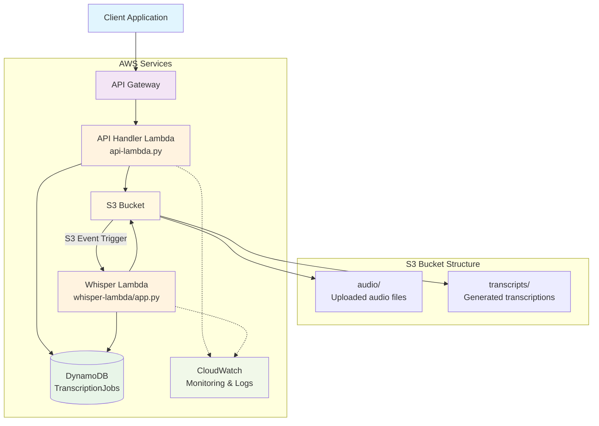

# Audio Transcription Service

A serverless audio transcription service built on AWS using OpenAI's Whisper model. This cloud-native application automatically transcribes audio files uploaded by users, providing job tracking and seamless client interaction through a REST API.

## What This Application Does

The Audio Transcription Service is a fully managed, serverless solution that:

- **Accepts audio file uploads** through a secure REST API
- **Automatically transcribes audio** using OpenAI's Whisper model running in AWS Lambda containers
- **Tracks job progress** with real-time status updates stored in DynamoDB
- **Provides secure download links** for completed transcriptions
- **Scales automatically** based on demand without manual intervention
- **Manages the entire workflow** from upload to transcription completion

### Key Features

- ✅ **Serverless Architecture** - No infrastructure management required
- ✅ **Secure File Handling** - Pre-signed URLs for secure uploads and downloads
- ✅ **Job Tracking** - Real-time status monitoring with unique job IDs
- ✅ **Auto-scaling** - Handles varying workloads automatically
- ✅ **Cost-effective** - Pay only for what you use
- ✅ **High Availability** - Built on AWS managed services

## Repository Structure

```
cloud_computing_project/
├── src/
│   ├── client-CLI/
│   │   └── client.py              # Python CLI client for testing the service
│   └── lambda-functions/
│       ├── api-lambda.py          # API Gateway handler Lambda function
│       └── whisper-lambda/
│           ├── app.py             # Whisper transcription Lambda function
│           ├── Dockerfile         # Container image for Whisper Lambda
│           └── requirements.txt   # Python dependencies for Whisper
├── docs/                          # Documentation and performance evaluation
└── README.md                      # This file
```

### Folder Descriptions

#### `/src/client-CLI/`
Contains a Python command-line client that demonstrates how to interact with the transcription service:
- **`client.py`** - Full-featured CLI client that can upload audio files, poll for job status, and download completed transcriptions

#### `/src/lambda-functions/`
Contains the AWS Lambda functions that power the service:
- **`api-lambda.py`** - Handles HTTP requests from API Gateway, manages job creation and status retrieval
- **`whisper-lambda/`** - Container-based Lambda function that performs the actual audio transcription using OpenAI's Whisper model

## Architecture

The service follows a serverless architecture pattern using AWS managed services:



### Architecture Flow

1. **Job Creation**: Client sends POST request to `/upload` endpoint
   - API Lambda generates unique jobId and pre-signed S3 upload URL
   - Job status saved as "UPLOADING" in DynamoDB

2. **File Upload**: Client uploads audio file directly to S3 using pre-signed URL
   - File stored in `audio/` folder with jobId tag

3. **Transcription Processing**: S3 upload triggers Whisper Lambda
   - Downloads audio file from S3
   - Processes with OpenAI Whisper model in container
   - Saves transcript to `transcripts/` folder
   - Updates job status to "COMPLETED" in DynamoDB

4. **Result Retrieval**: Client polls `/status/{jobId}` endpoint
   - Returns job status and download URL when ready
   - Pre-signed URL provides secure access to transcript

### Core Components

- **Amazon S3**: Stores audio files and generated transcripts
- **AWS Lambda**: Serverless compute for API handling and transcription processing
- **API Gateway**: REST endpoint management with CORS support
- **DynamoDB**: Job tracking and status management
- **CloudWatch**: Monitoring, logging, and performance metrics

---

*This project is part of the Cloud Computing course final project, demonstrating serverless architecture, auto-scaling, and performance evaluation on AWS.*
